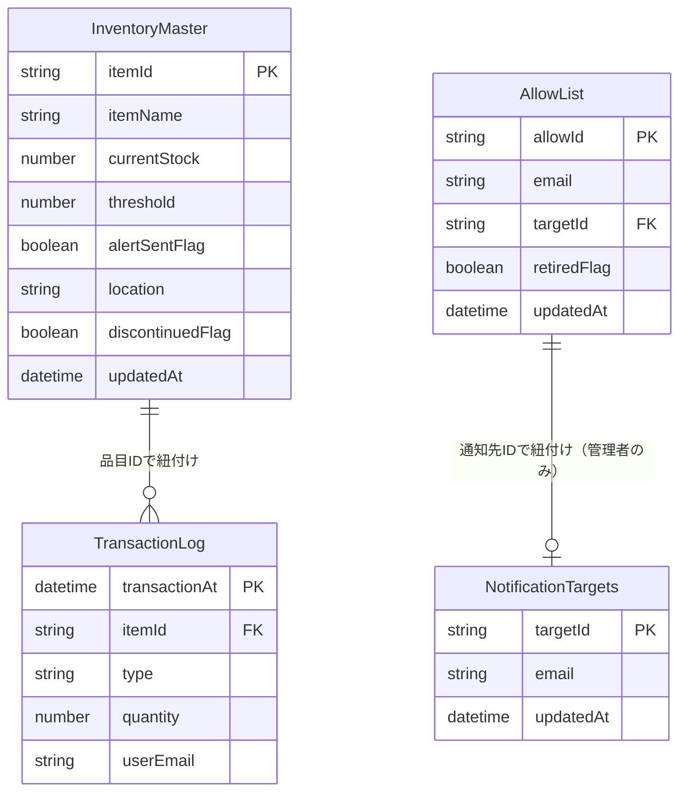

# データベース設計

- 対象システム：整備部品在庫管理システム
- 本書の位置付け：データベース（Googleスプレッドシート）の詳細設計
- 対象：要件定義書 7章のデータ設計を、実装可能な列定義まで落とし込んだもの

シート名はA1にヘッダー行を持つ想定とする。

---

## 1. 在庫マスタシート（`InventoryMaster`）

| 列 | 項目名 | 型 | 必須 | 備考 |
|---|---|---|---|---|
| A | 品目ID | 文字列 | ○ | QRコード化対象。一意。例: `PART-000123` |
| B | 品目名 | 文字列 | ○ | |
| C | 現在在庫数 | 数値 | ○ | 0以上 |
| D | 閾値 | 数値 | ○ | 0以上 |
| E | アラート送信済みフラグ | 真偽値(TRUE/FALSE) | ○ | 初期値FALSE |
| F | 保管場所 | 文字列 | 任意 | |
| G | 廃番フラグ | 真偽値 | ○ | 初期値FALSE。管理者のみ変更可(FR-11) |
| H | 更新年月日 | 日時 | ○ | 更新の都度自動更新 |

## 2. 入出庫履歴シート（`TransactionLog`）

| 列 | 項目名 | 型 | 必須 | 備考 |
|---|---|---|---|---|
| A | 入出庫日時 | 日時 | ○ | サーバー側で自動付与 |
| B | 品目ID | 文字列 | ○ | 在庫マスタと紐付け |
| C | 種別 | 文字列 | ○ | `IN` または `OUT` |
| D | 数量 | 数値 | ○ | 0以上 |
| E | ユーザ識別 | 文字列 | ○ | ログイン中のメールアドレス |

> 追記専用（INSERT ONLY）。既存行の更新・削除は行わない設計とする（監査ログ性を担保）。

## 3. 通知先設定シート（`NotificationTargets`）

| 列 | 項目名 | 型 | 必須 | 備考 |
|---|---|---|---|---|
| A | 通知先ID | 文字列 | ○ | 一意 |
| B | 通知先メールアドレス | 文字列 | ○ | |
| C | 更新年月日 | 日時 | ○ | |

> 品目ごとの紐付けは行わず、登録済み全アドレスへ一律通知（要件定義7.3節どおり）。

## 4. 許可リストシート（`AllowList`）

| 列 | 項目名 | 型 | 必須 | 備考 |
|---|---|---|---|---|
| A | 許可ID | 文字列 | ○ | 一意 |
| B | 許可メールアドレス | 文字列 | ○ | ログイン照合キー |
| C | 通知先ID | 文字列 | 条件付 | 管理者は通知先設定に対応するIDを設定、非管理者は空白 |
| D | 退職フラグ | 真偽値 | ○ | trueの場合ログイン拒否 |
| E | 更新年月日 | 日時 | ○ | |

> 「管理者級の整備士」の判定は、C列（通知先ID）が空欄でないことで行う（要件定義2章「権限による操作はDBの直接編集」に対応。管理者はスプレッドシート直接編集権限を別途Google側の共有設定で付与する）。

## 5. シート間の参照関係

