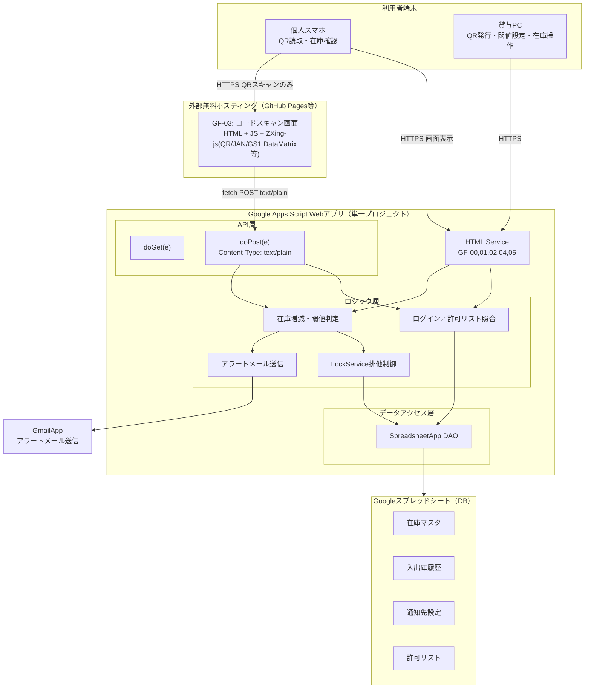

# 全体構成図
## 1. 目的
要件定義 9章「開発フロー」の3.全体設計にあたる。
以下をもって、本書の完了とする。

- システムを構成する2ドメイン（GAS Web App／外部ホスティング）の責務分界を明確にする
- GF-03(外部ホスティング)-GAS間のAPI仕様を確定する
- ログインセッション・トークンの引き継ぎ方式を確定する（4章・6章で開催予定だった課題への回答）
- スプレッドシートの列定義を実装可能なレベルまで落とし込む
- 一人開発＋AIコード生成前提（NR-05）のため、GASプロジェクトのファイル構成を先に決め、属人化を避ける

git管理するため、Markdown + Mermaidで作成する

## 2. 全体構成図


### 2.2. フォルダ構成
- inventory_system : プロジェクトルート
  - .github
    - workflows
      - deploy-gf03-scan.yml : src/external/gf03-scan/ のみをGitHub Pagesへデプロイするワークフロー（7章参照）
  - docs : ドキュメントフォルダ
    - requestments : 要件定義
      - requestment : 要件定義書
      - technical_verification.md : 技術検証資料
    - architecture : 設計書
      - overview.md : 全体設計書
      - sequence.md : シーケンス図
      - database.md : データベース設計
      - transition.md : 画面遷移設計
  - src : ソースフォルダ
    - core : バックエンド
      - code.gs : doGet/doPost（API層）のみ。ルーティングに専念し処理本体は書かない
      - auth.gs : login処理、トークン発行・検証（ロジック層）
      - inventory.gs : 在庫増減、閾値判定（ロジック層）
      - alert.gs : アラートメール送信（ロジック層）
      - sheetDao.gs : 全シートへの読み書き関数群（データアクセス層）。他ファイルからはこの層経由でのみシートにアクセスする
    - frontend : フロントエンド
      - html
        - GF00_login.html : ログイン画面
        - GF01_dashboard.html : ダッシュボード
        - GF02_inventory_list.html : 在庫一覧画面
        - GF04_qr_issue.html : QR設定画面
        - GF05_threshold_setting.html : 閾値設定画面
      - js
        - session.html : トークンのsessionStorage保管による
      - css
        - style.html : システム全体に影響するcss設定
    - external : 外部ホスティング
      - gf03-scan
        - index.html : カメラ起動・コード読取(QR/JAN/GS1 DataMatrix等、4.5節)・doPost呼び出しのみ。業務ロジックを持たない
  - verification : 技術検証用の使い捨てページ群(本番非対象)
    - gs1-datamatrix-scan
      - index.html : GS1 DataMatrix/JAN読み取り・GTIN抽出の実機検証用ページ

- 命名規則
  - ロジック層の内部専用関数（他ファイルから呼ばれない想定）は末尾に _ を付与する（GAS標準の可視性慣習）。例: findRowById_()
- コメント
  - 各関数の先頭に「何を受け取り、何を返し、何をロックするか」を1〜2行で記載する規約とする
- 各シートへのアクセスはSheetDao.gsに集約

## 3. ドメイン構成と責務の分離
| ドメイン | ホスティング | 保持するロジック | 理由 |
|---|---|---|---|
| GAS Web App | script.google.com（GASデプロイURL、実URLは非公開） | 認証・許可リスト照合・在庫増減・閾値判定・アラート送信・排他制御・DB入出力の業務ロジック | NR-05（保守性・属人化回避）に基づき、ロジックを1箇所に集約する |
| 外部ホスティング | GitHub Pages等 | カメラ起動・コードデコード（QR/JAN/GS1 DataMatrix等、4.5節）・読み取り結果とセッショントークンをGASへfetch送信するだけのUI層 | GAS HTML ServiceのサンドボックスがgetUserMedia等の機微APIを制限するため、この画面のみ分離せざるを得ない（要件定義6.2節） |

> 設計原則：GF-03には業務判定ロジック（在庫数計算・閾値比較等）を一切持たせない。すべてGAS側のdoPostに委譲し、GF-03はUIとネットワーク呼び出しに専念する。これによりリスク欄で挙げられた「2ドメインに跨ることによる保守対象増加」の影響を最小化する。

### 3.1. レイヤー構成(GAS内部)
- 要件定義6章の「API層・ロジック層・データアクセス層」を以下のファイル単位に対応させる（9章のファイル構成案も参照）。

| レイヤー | 責務 | 呼び出し元 |
|---|---|---|
| API層 | `doGet(e)` / `doPost(e)` でエントリポイントを一元化し、パラメータの妥当性チェック後、ロジック層へディスパッチ | HTML Service画面、GF-03からのfetch |
| ロジック層 | ログイン判定、在庫増減計算、閾値判定、排他制御呼び出し、メール送信判断 | API層 |
| データアクセス層 | シートの読み書きをカプセル化する関数群（`getSheet_()`, `findRowById_()`等） | ロジック層のみ。ロジック層以外から直接シートを触らせない |

## 4. API設計
GF-03からの呼び出し、および内部的なHTML ServiceからのGAS関数呼び出し（google.script.run）を統一的なAPIとして設計する。

### 4.1. 通信方式の使い分け
- GF-00, 01, 02, 04, 05
  - google.script.run
    - 同一プロジェクト内のため素直にGAS標準APIを使う
- GF-03
  - fetch() → doPost(e)
    - クロスオリジンのため。Content-Typeはtext/plain;charset=utf-8固定（application/jsonはpreflightに失敗するため不可、要件定義6章参照）

### 4.2. doPost 共通リクエスト仕様（GF-03専用）
```
POST <GASデプロイURL>
Content-Type: text/plain;charset=utf-8
 
Body（JSON文字列。GAS側で e.postData.contents を JSON.parse する）:
{
  "action": "scanProcess",
  "token": "<セッショントークン>",
  "itemId": "PART-000123",
  "type": "OUT",       // "IN" または "OUT"
  "quantity": 2
}
```

### 4.3. 共通レスポンス仕様
```json
{
  "status": "OK",        // "OK" | "ERROR"
  "message": "出庫を登録しました",
  "data": {
    "itemId": "PART-000123",
    "currentStock": 8
  }
}
```

| ステータス | 用途 |
|---|---|
| OK | 正常処理完了 |
| ERROR | トークン無効／期限切れ、品目未検出、数量不正、ロック取得失敗（タイムアウト）等 |

### 4.4. action一覧
| action | 呼び出し元 | 概要 |
|---|---|---|
| `login` | GF-00 | メールアドレス→許可リスト照合、トークン発行 |
| `getInventoryList` | GF-01, GF-02 | 在庫一覧取得（廃番フラグ考慮） |
| `getItemById` | GF-03（コード読取直後） | 読み取ったitemIdの品目情報を取得し、確認表示に使う。未登録時は`data.code:"ITEM_NOT_FOUND"`を返し、クライアント側の新規登録フォーム分岐に使う |
| `scanProcess` | GF-03 | 入庫／出庫登録（4.2の例）。`itemName`等を付与して呼ぶと、未登録品目の新規登録＋初回入庫（1点）を同一ロック内で原子的に行う（FR-12、4.5節） |
| `issueQr` | GF-04 | 新規品目登録＋QRコード発行 |
| `updateThreshold` | GF-05 | 閾値・通知先の更新 |
| `setDiscontinued` | GF-02（管理者のみ） | 廃番フラグ更新 |

> 実装時の注意：`scanProcess`は要件定義FR-06/FR-07/FR-09を1トランザクションとして扱う。在庫更新→アラート要否判定→（必要なら）メール送信→フラグ更新、をLockService内で一連に行う（6章シーケンス参照）。未登録品目の場合は、この一連の処理の前段で新規行追加（登録）を同じロック内に含める（FR-12）。登録直後は入庫（IN）のみ許可し、出庫は拒否する。

### 4.5. 識別コードの解釈方式（GF-03）
GF-03はZXing-jsによりQR／JAN（EAN-13）／GS1 DataMatrix／PDF417／CODE128を読み取り、フォーマットに応じて以下のルールでitemIdを決定してから`getItemById`／`scanProcess`へ渡す。これはコード形式に応じたデータ抽出であり、3章の「GF-03には業務判定ロジックを持たせない」という設計原則が対象とする在庫数計算・閾値比較等には該当しないものとする。

| フォーマット | itemIdの決定方法 |
|---|---|
| QRコード | 自社発行分は品目IDをそのまま平文で符号化しているため、デコード結果をそのまま使用する |
| JANコード（EAN-13） | 13桁の数字の先頭に`0`を付与し、GTIN-14として正規化する |
| GS1 DataMatrix等 | GS1 Application Identifier構造を解析し、AI「01」（GTIN）の値を抽出する。未対応AIに遭遇した場合や解析失敗時はエラーとし、誤った値をitemIdとして扱わない |

> 実機での読み取り・GTIN抽出の検証結果は `verification/gs1-datamatrix-scan/` を参照。

## 5. エラーハンドリング方針
- FE-01
  - 未登録メールアドレス、退職フラグtrue
    - GF-00でエラーメッセージ表示、ログイン拒否
- FE-02
  - トークン無効、期限切れ
    - GF-03から再ログイン導線へ誘導
- FE-03
  - ロック取得タイムアウト
    - status:ERRORを返却、クライアント側で再試行ボタン表示（要件定義10章リスク対応）
- FE-04
  - Gamilapp日次上限超過
    - 送信失敗をtry-catchで捕捉し、失敗をログに記録した上で在庫更新自体は成立させる（アラート送信失敗が在庫処理全体を止めないようにする）
- FE-05
  - GF-03外部ホスティング停止
    - 緊急時運用として紙記録に切り替え、復旧後まとめて登録する運用を別紙（運用手順書）に明文化（要件定義10章リスク対応）
- FE-06
  - 通信失敗(fetch失敗)
  - クライアント側でリトライ処理を実装
- FE-07
  - ボタン操作後、処理が反応しているか利用者に分からない
    - ログイン画面での「ログインできない/遅いのか判断できない」という利用者からの指摘を受け対応(2026-08-20)
    - 共通ヘルパー`setButtonLoading()`(session.html)により、`google.script.run`/`fetch`呼び出し中はボタンをスピナー付きの無効表示に切り替え、完了時に元のラベルへ戻す
    - 一覧取得系(在庫一覧・閾値設定・QR再発行プルダウン等)は取得中に「読み込み中…」表示に切り替える
    - GF-00(ログイン画面)は上記に加え、応答が5秒を超えた場合に「通信に時間がかかっています」という案内を追加表示し、単なる遅延と応答なしを利用者が区別できるようにする
    - GF-03は共通include(style.html/session.html)を持たない別オリジンのページのため、同等のCSS/JS(`.spinner`, `setButtonLoading()`)をindex.html内に複製して実装
- FE-08
  - ログインボタン押下後、エラーメッセージも出ずにログイン画面に留まったまま反応がない事例が発生(2026-08-20、詳細はsequence.md 1.3節)
    - 原因：プライベートブラウズモードやアプリ内ブラウザ等でsessionStorageの読み書きがブロックされる環境では、`login()`はGAS側で正常終了する(`status:"OK"`)ものの、クライアント側の`saveSession()`が例外を投げ、それ以降の処理(画面遷移)が実行されないままエラー表示もされずに終わっていた
    - 対応：`session.html`に`isSessionStorageAvailable_()`を追加し、①GF-00ページ読み込み時にストレージ利用可否を事前チェックして利用不可なら警告メッセージを表示(ログイン試行自体は妨げない)、②`doLogin()`の成功時処理(`saveSession()`+画面遷移)を`try/catch`で保護し、失敗時は原因が分かるメッセージを表示するよう変更した
    - 制約：本システムはセッション維持をsessionStorage前提で設計しており(1章・検証結果3)代替手段を持たないため、ストレージが完全にブロックされた環境ではこの警告表示以上の救済はできない(8.2節で代替案を検討事項として記録)

## 6. 非機能要件の実現方式
| 要件 | 設計での対応 |
|---|---|
| NR-01 利用者数10名程度 | GAS/スプレッドシートの同時実行制限内で収まる規模と判断するものの、LockService(FE-03、10秒タイムアウト)により対策する |
| NR-02 可用性 | 5章のエラーハンドリング、および紙記録への切り替え運用で対応 |
| NR-03 セキュリティ | 1章のトークン設計。なりすましは許容リスクとして明文化済み |
| NR-04 コスト | Google無料枠内。GmailApp送信数は5章のエラーハンドリングで超過時も業務継続する設計 |
| NR-05 保守性 | 6章のファイル構成・命名規則・コメント規約で対応 |
| NR-06 拡張性 | データアクセス層（SheetDao.gs）を分離しているため、将来的にスプレッドシート→Cloud SQL等への切替時もロジック層への影響を最小化できる。拠点追加時は在庫マスタに「拠点ID」列を追加する形で対応可能な設計としている|
| NR-07 データ整合性 | データ編集の競合があった際、基本的にはプログラムによる競合回避、それができないようであれば棚卸などの運用で対応 |

## 7. GF-03 デプロイ手順
### 7.1. 方式選定
- GitHub Pages標準の「docs/フォルダを公開」方式は、本リポジトリのdocs/を設計書用途（要件定義・設計書格納）で既に使用しているため採用しない
- Settings → Pages の Source を「GitHub Actions」に変更し、.github/workflows/deploy-gf03-scan.yml により src/external/gf03-scan/ 配下のみをビルド成果物として公開する方式を採用

### 7.2. 初回設定手順
1. GitHub側の一回限りの設定（Web UI操作、リポジトリ管理者が実施）
- リポジトリの Settings → Pages を開く
- Source を「GitHub Actions」に変更
- ワークフローファイルをコミット・プッシュする際、GitHub Actions関連ファイルの追加にはPATにworkflowスコープが必要（通常のリポジトリ操作用PATとは別途付与が必要な場合がある）

2. ワークフローファイルのコミット・プッシュ
- .github/workflows/deploy-gf03-scan.yml を追加し、mainブランチへpush
- push契機、またはworkflow_dispatch（Actionsタブから手動実行）でワークフローが起動し、src/external/gf03-scan/ が公開される

3. 公開確認
- Actionsタブでワークフロー「Deploy GF-03 scan page to GitHub Pages」の成功を確認
- 成功後、Settings → Pages に公開URLが表示されることを確認

4. アプリ側の接続設定（相互参照）
- src/external/gf03-scan/index.html 内の GAS_WEB_APP_URL 定数を、GASの /exec デプロイURLに書き換え、コミット・プッシュする（このpath変更が再度ワークフローを起動し、自動で再公開される）
- GAS側のスクリプトプロパティ GF03_URL に、発行された公開URLを設定する（GASエディタでの手動設定、CORS許可等の判定に使用）

### 7.3. 確定している設定値
- GF-03公開URL
  - GitHub Pages
  - `https://<GitHubユーザー名>.github.io/<リポジトリ名>/`（実URLはリポジトリには記載しない）
- GAS Web AppデプロイURL
  - src/external/gf03-scan/index.html 内 GAS_WEB_APP_URL
  - GASの /exec デプロイURL（実URLはリポジトリには記載しない。デプロイのたびに各自書き換える）
- GF-03公開URL（逆参照）
  - GASスクリプトプロパティ GF03_URL
  - 上記GF-03公開URLと同値（実URLはリポジトリには記載しない）

### 7.4. 運用上の注意点
- index.html（GAS_WEB_APP_URL書き換え等）を変更するたびにpushが必要で、そのpushが自動的に再デプロイをトリガーする（手動でのActions再実行は基本的に不要）
- GASのデプロイURLを再発行（新バージョンデプロイ等）した場合は、GAS_WEB_APP_URLの書き換え・再pushとスクリプトプロパティGF03_URL側は影響を受けないため見直し不要（GF03_URLはGF-03自身のURLでGAS URLではない点に注意）

## 8. 以降の検討事項
- 実装直前（要件定義10章のリスクにあるとおり）に、GAS HTML Serviceのカメラアクセス制限に関する最新の公式情報を再確認すること
  - 直近sく制したため、最新の公式情報に変更なし
- GF-04のQRコード印刷レイアウト（ラベル用紙サイズ等）の詳細は、実機での印刷検証を待って確定する
- 許可リストの定期棚卸の運用フロー（頻度・担当者）は、本書のスコープ外（運用設計フェーズで別途整理）
- GF-03のトークン漏えいリスクについて、QRコード自体にワンタイムパラメータを含める等の追加対策は、検証運用の結果を見て要否を判断する
- 「整備作業中は直接編集しない」という運用ルールは、管理者本人の自制に依存する形、運用手順に含めて提示する

### 8.1 検討したが見送った対応(2026-08-20)
- スマホからのログイン失敗事例を調査した結果、`login()`(auth.gs)・`findAllowListByEmail_()`(sheetDao.gs)ともメールアドレスの一致判定が`trim().toLowerCase()`止まりで、日本語IME経由の全角文字入力を正規化していない点を課題候補として確認した。ただし全角→半角の正規化対応は不要と判断し、実装は見送る
- GF-03はLINE等のアプリ内ブラウザ(WebView)で開くとカメラが起動できない事象を確認した。原因は検証結果1のGAS iframeサンドボックス制約とは別で、アプリ内ブラウザ自体のカメラAPI制限による(technical_verification.md 検証結果4参照)
  - 対応案として、①アプリ内ブラウザのUser-Agent検知による外部ブラウザへの誘導(LINEは`openExternalBrowser=1`パラメータで自動遷移可能。Instagram/Facebook等は案内表示止まり)、②カメラを使わない手入力フォールバックの追加、を検討した
  - いずれもコード実装はせず、「QRスキャン画面は必ずSafari/Chrome等の通常のWebブラウザで開く」運用ルールで対応することとした(取扱説明書に反映済み)

### 8.2 sessionStorageが使えない場合の代替手段(検討中、2026-08-20)
FE-08の警告表示は「気づける」ようにする対応であり、ストレージが実際にブロックされた環境そのものを救済するものではない。恒久対応として以下を比較検討中で、未着手。

| 案 | 内容 | 評価 |
|---|---|---|
| URLパラメータ引き継ぎ | GF-03と同じ方式(1章参照)をGF-00〜05間の内部遷移にも拡張し、sessionStorageが使えない場合のみtokenをURLパラメータで次ページへ引き継ぐ | 実現性は高い(既存パターンの流用)。ただし各画面のリンク・戻る導線すべてにtoken付与ロジックが必要になり影響範囲が広い。ブラウザ履歴にtokenが残るリスクが全画面に広がる点は、要件定義NR-03の許容リスクの範囲を拡大する判断が必要 |
| localStorageへの切替 | sessionStorageの代わりにlocalStorageを使う | 却下。ITP等の制限は保存先の種類を問わず及ぶため、sessionStorageで失敗する環境ではlocalStorageも同様に失敗する可能性が高く、根本解決にならない |
| Cookieベースのセッション | GASドメインのCookieでセッション保持 | 却下。検証結果3で既に「iframe構成のためCookieでのセッション保持がしにくい」ことを検証済みであり、再検証の価値は低い |

- 現時点の方針：発生頻度・影響範囲を見て要否を判断する。まずはFE-08の警告表示で運用回避(通常ブラウザでの利用を促す)を優先し、URLパラメータ方式への拡張は影響範囲が大きいため、同様の事例が複数件確認された場合に着手を検討する

## 9. GAS本体のデプロイ手順(clasp、導入中)
### 9.1 背景
- GAS本体(src/core, src/frontend)は、これまでGASエディタへの手動コピー&ペーストで反映していた
- 2026-08-20、この手動反映において「session.htmlの一部ファイルだけ更新し忘れる」という反映漏れが発生し、`GF00_login.html`が参照する関数(`isSessionStorageAvailable_`)が未定義エラーになる不具合が発生した(ブラウザコンソールで`ReferenceError`を確認)
- GF-03(外部ホスティング)は既に`.github/workflows/deploy-gf03-scan.yml`で自動デプロイされているが、GAS本体側には同様の仕組みがなく、手動反映のヒューマンエラーに起因する不具合が再発するリスクがあるため、まずはローカル環境からの`clasp`利用に切り替えることとした(GitHub Actionsでの完全自動化は、Google認証情報をCI上で管理する必要がありコストが高いため、現時点では見送り、8.2節の考え方と同様に必要性が高まった際に再検討する)

### 9.2 リポジトリ側の設定(設定済み)
- ルート直下に`.clasp.json`(rootDir: "src"。scriptIdは各自のApps ScriptプロジェクトIDを設定する。値は個人の環境に紐づくためリポジトリには実IDを記載しない)
- ルート直下に`.claspignore`(許可リスト方式。`src/appsscript.json`・`src/core/**/*.gs`・`src/frontend/**/*.html`のみを対象とし、`src/external/gf03-scan`(GF-03、GitHub Pagesへ別途自動デプロイされる別ドメインの画面)はGASプロジェクトの対象外として明示的に除外している)
- `package.json`(devDependenciesに`@google/clasp`。`npx clasp <command>`で利用可能。node_modules/はコミットしない)

### 9.3 各自が行う必要がある手順(未実施)
1. `npm install`(初回のみ、@google/claspをローカルに取得)
2. `npx clasp login`でGoogleアカウント認証(ブラウザでのOAuth同意が必要なため、対話的に実行できる環境で各自1回実施する)
3. 対象のApps Scriptプロジェクトのスクリプト ID を確認し(プロジェクトの設定(歯車アイコン)→「ID」欄、またはscript.google.com/d/<ID>/editのURLから取得)、`.clasp.json`の`scriptId`に設定する
4. `npx clasp status`で、push対象ファイルが意図通り(core/**/*.gs, frontend/**/*.html, appsscript.jsonのみ。external配下が含まれていないこと)か確認する
5. 問題なければ`npx clasp push`でコード反映、`npx clasp deploy`で新バージョンとしてデプロイする(deploy対象の既存デプロイIDを指定する場合は`npx clasp deployments`で確認)

### 9.4 運用上の注意点
- `clasp push`はコードの反映のみで、本番URL(/exec)には自動反映されない。必ず`clasp deploy`(新バージョンデプロイ)まで実施すること(この点は手動コピペ運用時の「保存しただけでは反映されない」という注意点と同じ)
- `.clasp.json`の`scriptId`は各自の認証済みGoogleアカウントに紐づくApps Scriptプロジェクトを指す。誤って別プロジェクトのIDを設定した状態で`push`すると、意図しないプロジェクトを上書きするため、初回設定時は`clasp status`での確認を必ず行う
