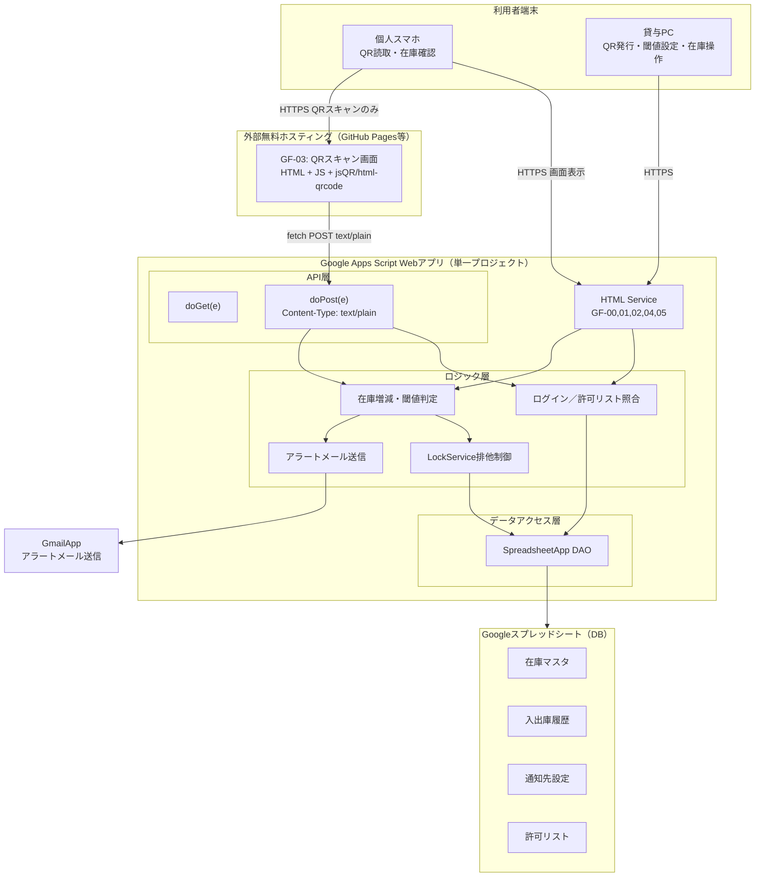

# 全体構成図
## 1. 目的
要件定義 9章「開発フロー」の3.全体設計にあたる。
以下をもって、本書の完了とする。

- システムを構成する2ドメイン（GAS Web App／外部ホスティング）の責務分界を明確にする
- GF-03(外部ホスティング)-GAS間のAPI仕様を確定する
- ログインセッション・トークンの引き継ぎ方式を確定する（4章・6章で開催予定だった課題への回答）
- スプレッドシートの列定義を実装可能なレベルまで落とし込む
- 一人開発＋AIコード生成前提（NR-05）のため、GASプロジェクトのファイル構成を先に決め、属人化を避ける

git管理するため、Markdown + Mermaidで作成する

## 2. 全体構成図


### 2.2. フォルダ構成
- inventory_system : プロジェクトルート
  - docs : ドキュメントフォルダ
    - requestments : 要件定義
      - requestment: 要件定義書
      - technical_verification.md : 技術検証資料
    - architecture : 設計書
      - overview.md : 全体設計書
      - sequence.md : シーケンス図
      - database.md : データベース設計
      - transition.md : 画面遷移設計
  - src : ソースフォルダ
    - core : バックエンド
      - code.gs : doGet/doPost（API層）のみ。ルーティングに専念し処理本体は書かない
      - auth.gs : login処理、トークン発行・検証（ロジック層）
      - inventory.gs : 在庫増減、閾値判定（ロジック層）
      - alert.gs : アラートメール送信（ロジック層）
      - sheetDao.gs : 全シートへの読み書き関数群（データアクセス層）。他ファイルからはこの層経由でのみシートにアクセスする
    - frontend : フロントエンド
      - html
        - GF00_login.html : ログイン画面
        - GF01_dashboard.html : ダッシュボード
        - GF02_inventory_list.html : 在庫一覧画面
        - GF04_qr_issue.html : QR設定画面
        - GF05_threshold_setting.html : 閾値設定画面
      - js
      - css
    - external : 外部ホスティング
      - gf03-scan
        - index.html : カメラ起動・QR読取・doPost呼び出しのみ。業務ロジックを持たない

- 命名規則
  - ロジック層の内部専用関数（他ファイルから呼ばれない想定）は末尾に _ を付与する（GAS標準の可視性慣習）。例: findRowById_()
- コメント
  - 各関数の先頭に「何を受け取り、何を返し、何をロックするか」を1〜2行で記載する規約とする
- 各シートへのアクセスはSheetDao.gsに集約

## 3. ドメイン構成と責務の分離
| ドメイン | ホスティング | 保持するロジック | 理由 |
|---|---|---|---|
| GAS Web App | script.google.com（GASデプロイURL） | 認証・許可リスト照合・在庫増減・閾値判定・アラート送信・排他制御・DB入出力の業務ロジック | NR-05（保守性・属人化回避）に基づき、ロジックを1箇所に集約する |
| 外部ホスティング | GitHub Pages等 | カメラ起動・QRデコード・読み取り結果とセッショントークンをGASへfetch送信するだけのUI層 | GAS HTML ServiceのサンドボックスがgetUserMedia等の機微APIを制限するため、この画面のみ分離せざるを得ない（要件定義6.2節） |

> 設計原則：GF-03には業務判定ロジック（在庫数計算・閾値比較等）を一切持たせない。すべてGAS側のdoPostに委譲し、GF-03はUIとネットワーク呼び出しに専念する。これによりリスク欄で挙げられた「2ドメインに跨ることによる保守対象増加」の影響を最小化する。

### 3.1. レイヤー構成(GAS内部)
- 要件定義6章の「API層・ロジック層・データアクセス層」を以下のファイル単位に対応させる（9章のファイル構成案も参照）。

| レイヤー | 責務 | 呼び出し元 |
|---|---|---|
| API層 | `doGet(e)` / `doPost(e)` でエントリポイントを一元化し、パラメータの妥当性チェック後、ロジック層へディスパッチ | HTML Service画面、GF-03からのfetch |
| ロジック層 | ログイン判定、在庫増減計算、閾値判定、排他制御呼び出し、メール送信判断 | API層 |
| データアクセス層 | シートの読み書きをカプセル化する関数群（`getSheet_()`, `findRowById_()`等） | ロジック層のみ。ロジック層以外から直接シートを触らせない |

## 4. API設計
GF-03からの呼び出し、および内部的なHTML ServiceからのGAS関数呼び出し（google.script.run）を統一的なAPIとして設計する。

### 4.1. 通信方式の使い分け
- GF-00, 01, 02, 04, 05
  - google.script.run
    - 同一プロジェクト内のため素直にGAS標準APIを使う
- GF-03
  - fetch() → doPost(e)
    - クロスオリジンのため。Content-Typeはtext/plain;charset=utf-8固定（application/jsonはpreflightに失敗するため不可、要件定義6章参照）

### 4.2. doPost 共通リクエスト仕様（GF-03専用）
```
POST <GASデプロイURL>
Content-Type: text/plain;charset=utf-8
 
Body（JSON文字列。GAS側で e.postData.contents を JSON.parse する）:
{
  "action": "scanProcess",
  "token": "<セッショントークン>",
  "itemId": "PART-000123",
  "type": "OUT",       // "IN" または "OUT"
  "quantity": 2
}
```

### 4.3. 共通レスポンス仕様
```json
{
  "status": "OK",        // "OK" | "ERROR"
  "message": "出庫を登録しました",
  "data": {
    "itemId": "PART-000123",
    "currentStock": 8
  }
}
```

| ステータス | 用途 |
|---|---|
| OK | 正常処理完了 |
| ERROR | トークン無効／期限切れ、品目未検出、数量不正、ロック取得失敗（タイムアウト）等 |

### 4.4. action一覧
| action | 呼び出し元 | 概要 |
|---|---|---|
| `login` | GF-00 | メールアドレス→許可リスト照合、トークン発行 |
| `getInventoryList` | GF-01, GF-02 | 在庫一覧取得（廃番フラグ考慮） |
| `getItemById` | GF-03（QR読取直後） | 読み取ったitemIdの品目情報を取得し、確認表示に使う |
| `scanProcess` | GF-03 | 入庫／出庫登録（4.2の例） |
| `issueQr` | GF-04 | 新規品目登録＋QRコード発行 |
| `updateThreshold` | GF-05 | 閾値・通知先の更新 |
| `setDiscontinued` | GF-02（管理者のみ） | 廃番フラグ更新 |

> 実装時の注意：`scanProcess`は要件定義FR-06/FR-07/FR-09を1トランザクションとして扱う。在庫更新→アラート要否判定→（必要なら）メール送信→フラグ更新、をLockService内で一連に行う（6章シーケンス参照）。

## 5. エラーハンドリング方針
- FE-01
  - 未登録メールアドレス、退職フラグtrue
    - GF-00でエラーメッセージ表示、ログイン拒否
- FE-02
  - トークン無効、期限切れ
    - GF-03から再ログイン導線へ誘導
- FE-03
  - ロック取得タイムアウト
    - status:ERRORを返却、クライアント側で再試行ボタン表示（要件定義10章リスク対応）
- FE-04
  - Gamilapp日次上限超過
    - 送信失敗をtry-catchで捕捉し、失敗をログに記録した上で在庫更新自体は成立させる（アラート送信失敗が在庫処理全体を止めないようにする）
- FE-05
  - GF-03外部ホスティング停止
    - 緊急時運用として紙記録に切り替え、復旧後まとめて登録する運用を別紙（運用手順書）に明文化（要件定義10章リスク対応）
- FE-06
  - 通信失敗(fetch失敗)
  - クライアント側でリトライ処理を実装

## 6. 非機能要件の実現方式
| 要件 | 設計での対応 |
|---|---|
| NR-01 利用者数10名程度 | GAS/スプレッドシートの同時実行制限内で収まる規模と判断するものの、LockService(FE-03、10秒タイムアウト)により対策する |
| NR-02 可用性 | 5章のエラーハンドリング、および紙記録への切り替え運用で対応 |
| NR-03 セキュリティ | 1章のトークン設計。なりすましは許容リスクとして明文化済み |
| NR-04 コスト | Google無料枠内。GmailApp送信数は5章のエラーハンドリングで超過時も業務継続する設計 |
| NR-05 保守性 | 6章のファイル構成・命名規則・コメント規約で対応 |
| NR-06 拡張性 | データアクセス層（SheetDao.gs）を分離しているため、将来的にスプレッドシート→Cloud SQL等への切替時もロジック層への影響を最小化できる。拠点追加時は在庫マスタに「拠点ID」列を追加する形で対応可能な設計としている|
| NR-07 データ整合性 | データ編集の競合があった際、基本的にはプログラムによる競合回避、それができないようであれば棚卸などの運用で対応 |

## 7. 以降の検討事項
- 実装直前（要件定義10章のリスクにあるとおり）に、GAS HTML Serviceのカメラアクセス制限に関する最新の公式情報を再確認すること
- GF-04のQRコード印刷レイアウト（ラベル用紙サイズ等）の詳細は、実機での印刷検証を待って確定する
- 許可リストの定期棚卸の運用フロー（頻度・担当者）は、本書のスコープ外（運用設計フェーズで別途整理）
- GF-03のトークン漏えいリスクについて、QRコード自体にワンタイムパラメータを含める等の追加対策は、検証運用の結果を見て要否を判断する
- 「整備作業中は直接編集しない」という運用ルールは、管理者本人の自制に依存する形、運用手順に含めて提示する