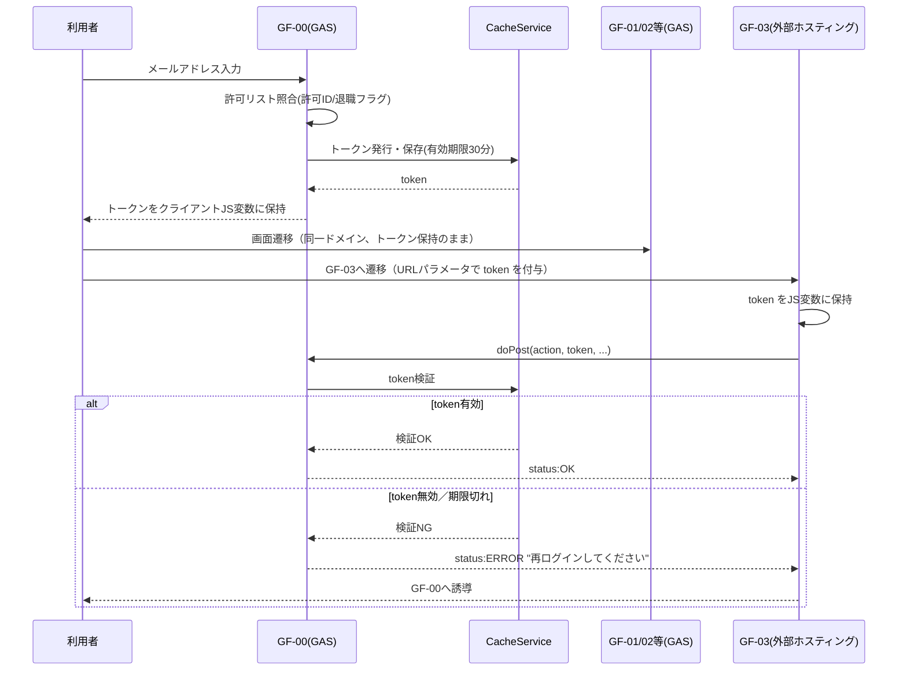
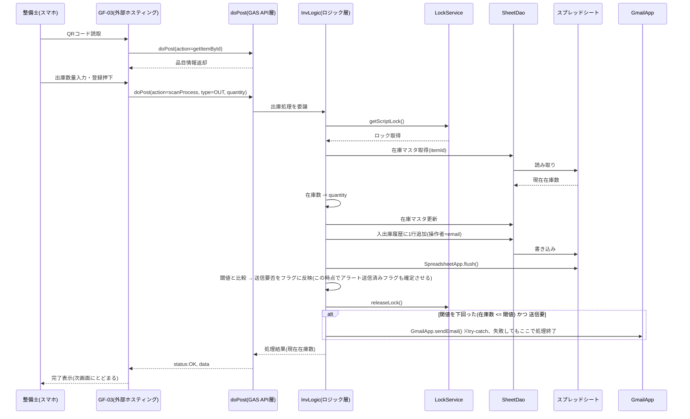
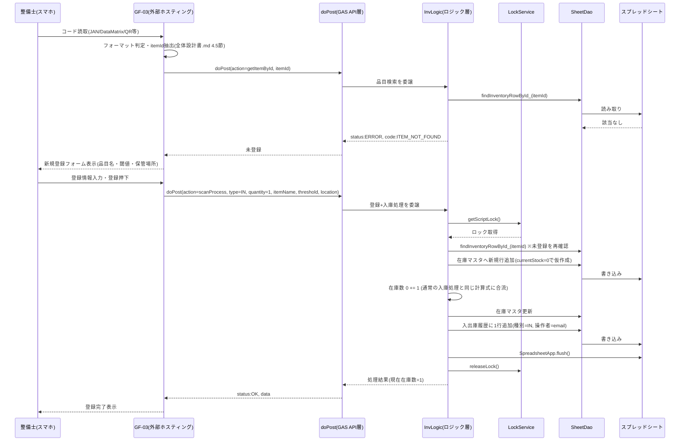

# セッション・トークン設計 / シーケンス設計
- 対象システム：整備部品在庫管理システム
- 本書の位置付け：セッション設計・処理フローの詳細設計
- 前提：GAS Web App と 外部ホスティング（GF-03）の2ドメイン構成

---

## 1. セッション・トークン設計
### 1.1 トークンのライフサイクル

### 1.2 設計上の要点（要件定義10章リスクへの対応方針を具体化）

- 有効期限：30分固定。`CacheService.getScriptCache().put(token, email, 1800)`
- GF-03への引き継ぎはURLパラメータ（`?token=xxx`）とする。漏えいリスクへの対応として、
  - トークンは推測困難なランダム文字列（UUID等）とし、メールアドレス等の個人情報を直接含めない
  - 使用の都度、CacheServiceで有効性を検証する（1.1のalt分岐）
  - ブラウザ履歴に残るリスクは許容リスクとして要件定義NR-03同様に明文化する
- なりすまし対策は行わない（要件定義NR-03の許容リスクを踏襲）

---

## 2. シーケンス設計
### 2.1 出庫処理シーケンス（GF-03起点、FR-06・FR-09該当）

### 2.2 入庫処理シーケンス（FR-07該当）の差分

出庫と同一のトランザクション構造（2.1と同じ流れ）だが、以下が異なる。

- 在庫数は `+= quantity`
- 閾値判定は「入庫後に閾値以上(在庫数 > 閾値)へ回復したか」を見る
- 回復した場合、送信済みフラグを `true → false` に戻す（再度閾値を下回った際に再通知できるようにする）

### 2.3 排他制御の要点（技術検証結果の反映）

- `LockService.getScriptLock()` を在庫更新の開始時に取得し、シート書き込み完了後・ロック解放前に必ず `SpreadsheetApp.flush()` を呼ぶ（要件定義6章の検証済み注意点）
- ロック取得タイムアウト（例：10秒）を設定し、失敗時は `status:ERROR` を返してクライアント側でリトライ導線を表示する（要件定義10章リスク「通信失敗」対応。詳細は `全体設計書.md` エラーハンドリング方針参照）

### 2.4 ログインシーケンス（1.1と対応）

ログイン自体のシーケンスは「1.1 トークンのライフサイクル」と同一フローのため、本節では重複させず1.1を参照する。

### 2.5 未登録品目スキャン時の自動登録シーケンス（FR-12該当）

- 「未登録判定」から「新規行追加」までを同一のLockService区間内で行うことで、確認(`getItemById`)と登録(`scanProcess`)の間に別ユーザーの操作が割り込むレース条件を避ける。`getItemById`での未登録判定はあくまで画面分岐用の参考情報であり、実際の登録可否は`scanProcess`内で再判定する
- 新規登録時は種別を`IN`固定とし、`OUT`は拒否する(存在しない品目からの出庫を防止するため)
- 登録済み品目の通常の入出庫は2.1・2.2のシーケンスと同一のまま変更なし(識別コードの取得元がQRかJAN/DataMatrixかを問わない)