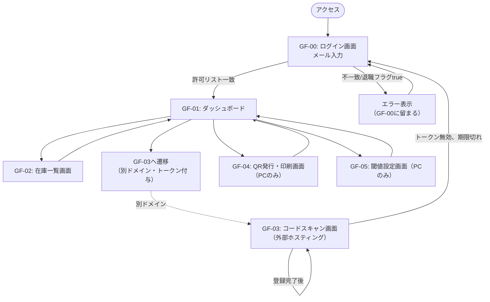
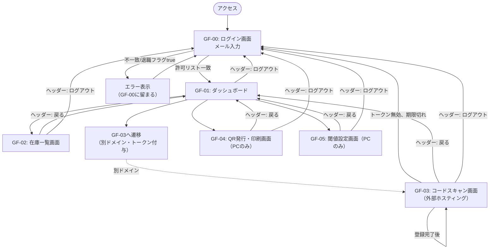

# 画面設計

- 対象システム：整備部品在庫管理システム
- 本書の位置付け：画面遷移の詳細設計
- 対応する画面一覧：要件定義書 8章（GF-00〜GF-05）

---

## 1. 画面遷移図

## 2. 画面共通要素
GF-01〜GF-05の各画面ヘッダーに、以下の共通導線を追加する。
 
| 要素 | 表示画面 | 遷移先・処理 | 備考 |
|---|---|---|---|
| ダッシュボードに戻るリンク | GF-02, GF-03, GF-04, GF-05 | GF-01 | GF-03（外部ホスティング）から戻る場合は別ドメインへの遷移となるため、URLパラメータでトークンを再度引き継ぐ（1章のトークンをそのまま流用、再ログイン不要） |
| ログアウトボタン | GF-01〜GF-05（共通ヘッダー） | GF-00 | クライアント側でJS変数上のトークンを破棄し、GF-00へ遷移する。CacheService側のトークンは明示的に無効化せず、`sequence.md`1.2の30分TTLによる自然失効に委ねる（NR-05の単純化方針を優先した設計判断） |
 
> 上記により1章の画面遷移図における「GF02/GF04/GF05 → GF01」の矢印は「ダッシュボードに戻るリンク」経由、GF-03→GF-01も同様の導線として扱う。ログアウトは全画面からGF-00への遷移を追加するものとし、遷移図は以下の通り更新する。
 

## 3. 画面別・端末対応と遷移条件

| 画面 | 端末 | 遷移元 | 遷移条件・備考 |
|---|---|---|---|
| GF-00 | スマホ／PC | 初回アクセス | 許可リスト照合。退職フラグtrueは拒否 |
| GF-01 | スマホ／PC | GF-00成功後 | セッション保持中は再ログイン不要（トップ画面として都度戻る） |
| GF-02 | スマホ／PC | GF-01 | 廃番品目は論理削除表示（一覧から非表示 or グレーアウト） |
| GF-03 | スマホのみ | GF-01（別ドメインへ遷移） | URLパラメータでトークンを引き継ぐ |
| GF-04 | PCのみ | GF-01 | スマホでは導線を非表示にする |
| GF-05 | PCのみ | GF-01 | 同上 |

## 4. 画面ごとの実装先

| 画面 | ホスティング先 | 備考 |
|---|---|---|
| GF-00, GF-01, GF-02, GF-04, GF-05 | Google Apps Script（HTML Service） | カメラ機能不要のため制約なし |
| GF-03 | 外部無料ホスティング（GitHub Pages） | カメラアクセスにはGASのiframeサンドボックス外への切り出しが必須（要件定義6.2節） |

## 5. 画面ごとの主な入出力（実装時チェックリスト）

| 画面 | 主な入力 | 主な出力・表示 | 呼び出すAPI（`全体設計書.md` 4章 参照） |
|---|---|---|---|
| GF-00 | メールアドレス | ログイン成否 | `login` |
| GF-01 | なし | 各画面への導線 | なし（画面遷移のみ） |
| GF-02 | 廃番切替操作（管理者のみ） | 品目ID・品目名・現在在庫数・閾値の一覧 | `getInventoryList`, `setDiscontinued` |
| GF-03 | コード（カメラ、QR／JAN／GS1 DataMatrix等）、未登録時は品目名等の新規登録情報、入出庫種別、数量 | 品目情報の確認表示、新規登録フォーム、登録完了メッセージ | `getItemById`, `scanProcess` |
| GF-04 | 品目名等の新規登録情報 | 生成されたQRコード・印刷レイアウト | `issueQr` |
| GF-05 | 閾値、通知先メールアドレス | 現在の設定値 | `updateThreshold` |

### 5.2. QR再発行機能
- 既存品目（品目ID）を一覧から選択し、DBへの新規登録・更新を伴わずクライアント側でQRコードを再生成する機能
- QRコードは品目IDを直接エンコードしているため、サーバー側に新規APIを追加せずgetInventoryListで取得済みの品目一覧から選択するだけで実現している（在庫マスタのitemId・itemNameは不変のため、再生成しても内容は初回発行時と同一）

### 5.3. GF-03内の画面状態（未登録品目の自動登録、FR-12）
GF-03は単一ページ内で以下の状態を切り替える形で実装しており、画面遷移図（1章）上は同一ノード（GF-03）内部の遷移として扱う。

| 状態 | 表示内容 | 遷移条件 |
|---|---|---|
| スキャン中 | カメラ映像 | 初期状態、または「スキャンに戻る」操作 |
| 確認画面 | 品目ID・品目名・現在在庫数、入出庫種別・数量入力 | `getItemById`が登録済み品目を返した場合 |
| 新規登録画面 | 読み取ったコード、品目名・閾値・保管場所の入力欄 | `getItemById`が`code:"ITEM_NOT_FOUND"`を返した場合 |
| 完了画面 | 登録・入出庫完了メッセージ | `scanProcess`が成功した場合 |
| エラー画面 | エラーメッセージ、再試行／ログイン導線 | 通信失敗、トークン無効等 |

詳細シーケンスは `sequence.md` 2.5節を参照。
