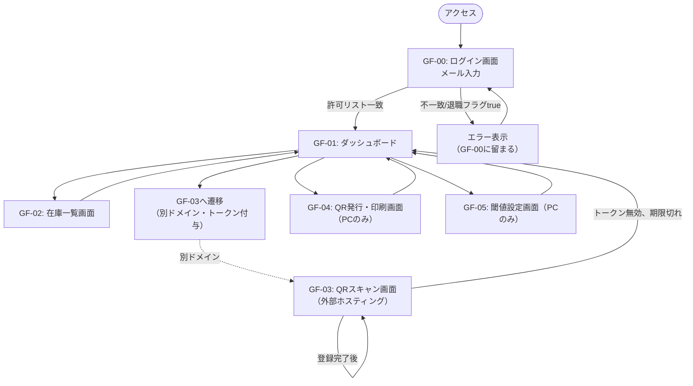

# 画面設計

- 対象システム：整備部品在庫管理システム
- 本書の位置付け：画面遷移の詳細設計
- 対応する画面一覧：要件定義書 8章（GF-00〜GF-05）

---

## 1. 画面遷移図

## 2. 画面別・端末対応と遷移条件

| 画面 | 端末 | 遷移元 | 遷移条件・備考 |
|---|---|---|---|
| GF-00 | スマホ／PC | 初回アクセス | 許可リスト照合。退職フラグtrueは拒否 |
| GF-01 | スマホ／PC | GF-00成功後 | セッション保持中は再ログイン不要（トップ画面として都度戻る） |
| GF-02 | スマホ／PC | GF-01 | 廃番品目は論理削除表示（一覧から非表示 or グレーアウト） |
| GF-03 | スマホのみ | GF-01（別ドメインへ遷移） | URLパラメータでトークンを引き継ぐ |
| GF-04 | PCのみ | GF-01 | スマホでは導線を非表示にする |
| GF-05 | PCのみ | GF-01 | 同上 |

## 3. 画面ごとの実装先

| 画面 | ホスティング先 | 備考 |
|---|---|---|
| GF-00, GF-01, GF-02, GF-04, GF-05 | Google Apps Script（HTML Service） | カメラ機能不要のため制約なし |
| GF-03 | 外部無料ホスティング（GitHub Pages等） | カメラアクセスにはGASのiframeサンドボックス外への切り出しが必須（要件定義6.2節） |

## 4. 画面ごとの主な入出力（実装時チェックリスト）

| 画面 | 主な入力 | 主な出力・表示 | 呼び出すAPI（`全体設計書.md` 4章 参照） |
|---|---|---|---|
| GF-00 | メールアドレス | ログイン成否 | `login` |
| GF-01 | なし | 各画面への導線 | なし（画面遷移のみ） |
| GF-02 | 廃番切替操作（管理者のみ） | 品目ID・品目名・現在在庫数・閾値の一覧 | `getInventoryList`, `setDiscontinued` |
| GF-03 | QRコード（カメラ）、入出庫種別、数量 | 品目情報の確認表示、登録完了メッセージ | `getItemById`, `scanProcess` |
| GF-04 | 品目名等の新規登録情報 | 生成されたQRコード・印刷レイアウト | `issueQr` |
| GF-05 | 閾値、通知先メールアドレス | 現在の設定値 | `updateThreshold` |